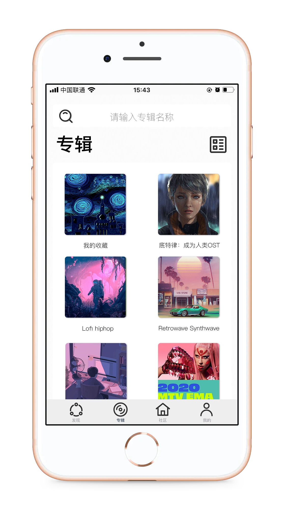

# MoonUI

## 项目简介

UI课设，一个简洁音乐播放APP页面设计，借鉴了小宇宙的播客设计，主打根据兴趣推荐音乐，减少冗余的功能。

## Preview

## 素材使用情况

**IconPark** 

> 来自字节跳动的一个通过技术驱动矢量图标样式的开源图标库。

提供了本项目的部分图标。

[Github地址](https://github.com/bytedance/IconPark)

**Snapmod**

>  Snapmod 可以让您轻松的把截图添加到设备外壳中，您可以用它分享您的截图、壁纸或者App。

提供本项目的iPhone外壳素材。

[Google Play](https://play.google.com/store/apps/details?id=cn.gavinliu.snapmod)

## License

[MIT](https://github.com/nishanths/license/blob/master/LICENSE)